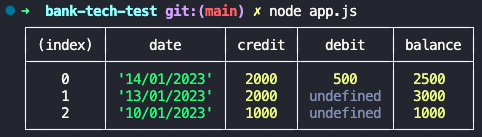

# Bank TechTest

  
***


### The problem - User story:
```
As a user,
I want to be able to deposit in my account
So that I can control my bank account

As a user,
I want to be able to withdraw from my account
So that I can control my bank account

As a user, 
I want to be able to view my bank statement
So that I can control my bank account
```
### How did I approach designing my solution to the problem?
I created a function to get the amount deposited, another to get the amount withdrawn, and another to calculate the account's total balance.
Also, a new function to create the data to be inserted in a table. I treated each transaction performed as a new object so that I could feed the table. Finally, I printed the table in the console, and the user can see the dates of their transactions and the total balance amount in each transaction.


### How did I structure my code, and why did I in this way?
I opened an MD file and wrote what needed to be done. I wrote the main functions and test examples. Then I added a test, waited for the test to fail, wrote my code, waited for the test to pass, and refactored the code myself. And so I did for each function I needed to add to satisfy the user with my code. 


### How to install and run my code and tests?
```
nvm use node
npm init -y
npm add jest
npm install -g jest

jest
```


### Screenshot of the output

